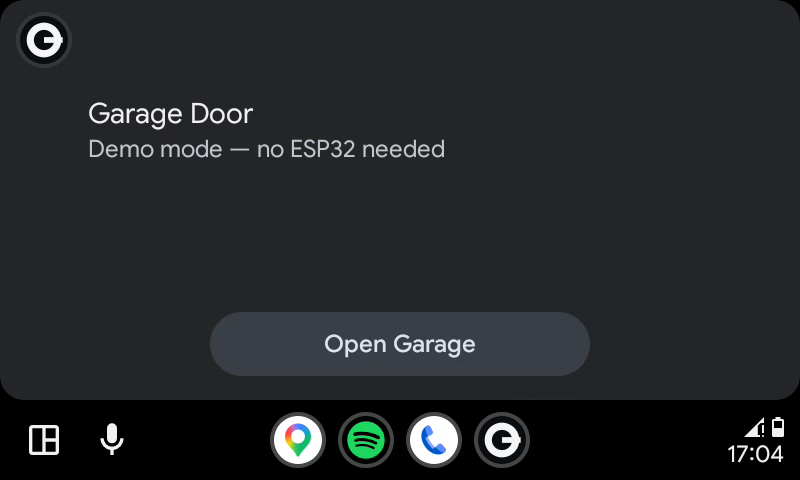
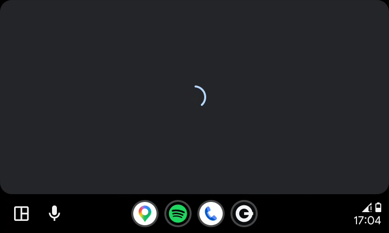
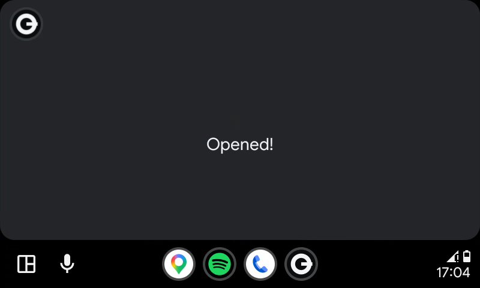
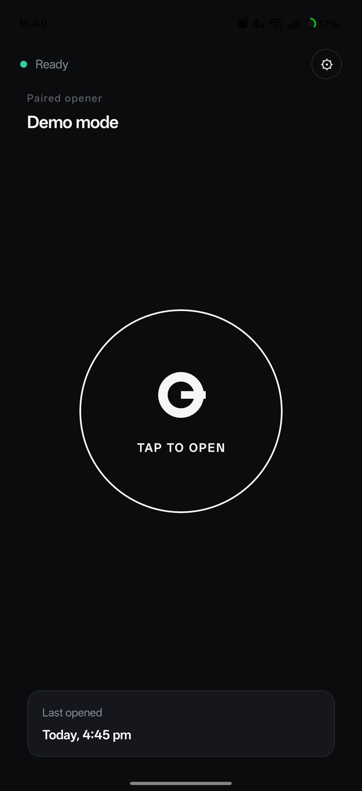
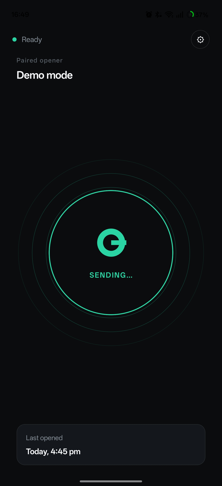
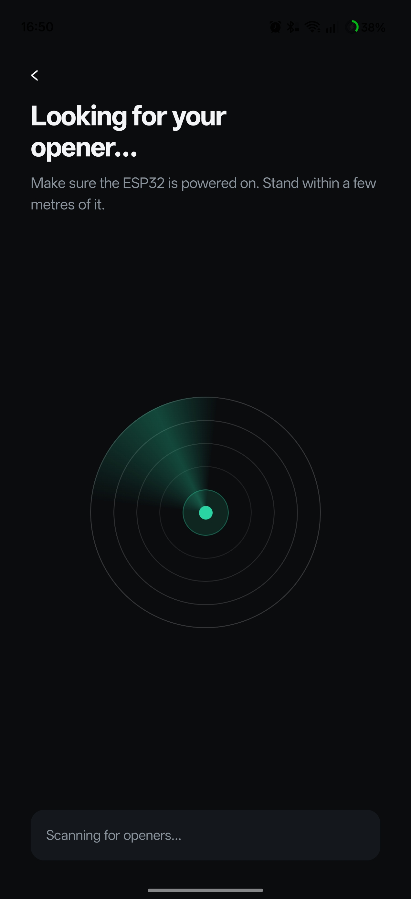
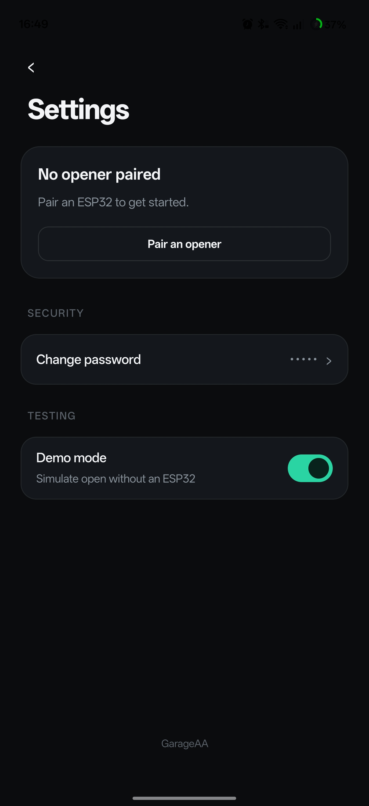

# GarageAAtoESP32

Pull into your garage and it opens itself — triggered from your car's screen, no phone fumbling, no cloud, no subscription.

<a href="https://play.google.com/store/apps/details?id=com.dunnowsoftware.GarageAAtoESP32">
  
</a>

### What it looks like in the car

| Idle | Sending | Opened |
|---|---|---|
|  |  |  |

Tap once to send. The screen shows a spinner while the BLE round-trip runs (typically &lt;1s) and a confirmation when the door receives the open command. Failures show a "Try Again" button instead of auto-resetting, so you don't have to scramble to react while driving.

### What it looks like on the phone

| Main (idle) | Sending | Pairing scan | Settings |
|---|---|---|---|
|  |  |  |  |

The phone app mirrors the in-car flow but is the primary surface for setup. The hero open button doubles as a status indicator — concentric pulses while sending, fills green on success, fills pastel red on failure. The pairing screen runs a real BLE scan with a sweeping radar visual; tap the device that appears in the bottom sheet to pair it. Settings is grouped by Security / Testing / (Danger zone, when paired).

---

## Who is this for?

This project exists for a specific situation: you use a **shared or communal garage** — a car park in an apartment block, a rented space, a co-owned facility — where you have **no access to the motor or the gate controller**. You can't wire into the existing system, you can't install a proper smart opener, and the management won't let you touch anything. All you have is a key fob.

This gives you a hands-free way to open the door from your car's Android Auto screen without touching your phone. It works entirely over Bluetooth — no internet, no cloud, no subscription, no hub. The ESP32 presses the fob button for you when you tap the screen — either riding in the car itself powered off the car's USB / 12V socket (recommended for a single car / single user), or fixed near the entrance powered by a USB charger or battery (better for shared garages with multiple users or multiple vehicles). See [Two ways to deploy](#two-ways-to-deploy) for the trade-offs.

There are **three ways** to do the actual button-press, including one that requires no soldering and doesn't modify the fob — important if you have to give it back when you move out. See [Choose your trigger mechanism](#choose-your-trigger-mechanism) below.

It is **not** a replacement for a proper smart garage opener — if you own the garage and have access to the motor, there are better, cleaner solutions. This is specifically for the case where you have no choice but to use the fob.

### Two ways to deploy

**In the car** *(recommended for a single car / single user)*: ESP32 + fob both ride in the car, powered off the car's USB or 12V socket via a USB-A adapter. The car's display becomes a permanent "open garage" button — tap once and the fob inside the glovebox triggers the gate. This is the smoothest experience: BLE always works because the ESP32 is in the same vehicle as your phone; the only range that matters is the fob's RF range to the gate motor from inside the car (typically 50–100 m, usually more than enough). No connectivity concerns, no power planning, no outdoor enclosure — the whole unit travels with the car and charges whenever the car is on. The in-car auto-fire (triggers automatically when the app detects the ESP32 in range on the AA screen) is particularly effective here.

**At the garage** *(better for multi-user / multi-vehicle setups)*: ESP32 lives near the gate, powered by a wall outlet / power bank / solar, and is hidden in or near the entrance. The fob stays at the garage. This is the only deployment that supports **multiple users or multiple vehicles** — anyone you share the password with (other family members, housemates, visiting friends with their own car) can install the app on their own phone and open the same gate without you having to be there or hand anything over. The trade-off: you're now relying on BLE range from a phone in the car to a fixed point near the gate entrance (typically 10–30 m with walls; plan your placement accordingly). The firmware is optimized for this mode (low-power deep sleep, wake-on-BLE-advertising).

---

**How it works:** An ESP32 sits at the garage and is connected to a fob trigger mechanism (see the three options below). The Android app sends a BLE command from your phone directly to the ESP32, which then triggers the fob — exactly as if someone had pressed the button. No internet, no cloud, no Wi-Fi required.

## Quick start

### 1. Firmware

There is no pre-built firmware — the PIN must be yours, so you build it yourself. It's one step:

1. Connect your ESP32 via USB.
2. Download `GarageAAtoESP32-flash-tool.zip` from the [Releases](../../releases) page, extract it, and run the script for your OS:
   - **Windows:** double-click `flash.bat`
   - **Linux:** `chmod +x flash.sh && ./flash.sh`

The tool installs PlatformIO if needed, lets you pick your board, detects the port, asks for your PIN, compiles, and flashes. Your PIN is never saved to disk.

See [docs/provisioning.md](docs/provisioning.md) for full flashing instructions and troubleshooting.

### 2. Android app

- **Play Store** *(easiest, includes Android Auto)*: [Get it on Google Play](https://play.google.com/store/apps/details?id=com.dunnowsoftware.GarageAAtoESP32)
- **APK** *(no Play Store)*: download the latest `.apk` from the [Releases](../../releases) page and sideload it. **Note: sideloaded APKs do not work with Android Auto** — AA only loads apps installed through the Play Store.
- **Build from source**: open `android/` in [Android Studio](https://developer.android.com/studio), connect your phone via USB with debugging enabled, and click **Run**. Same limitation as the APK — Android Auto requires a Play Store install.

### 3. Configure the app (one-time setup on phone)

Open **Garage Opener** — it will walk you through scanning for your ESP32 and entering your PIN on first launch.

### 4. Use in car

Connect your phone to Android Auto. Open **Garage Opener** and tap **Open Garage**.

**Optional — geofence auto-open:** in the phone app, go to Settings → Auto-open, set your garage location on the map, adjust the trigger radius (15–75 m), and enable the toggle. From then on the garage opens automatically when you enter the geofence while Android Auto is connected — no tap needed. A notification is posted when the open fires so you always know it happened.

---

## Choose your trigger mechanism

The ESP32 supports **three ways** to press the fob's button. Pick the one that fits your situation; the firmware handles all three from a single config flag (`TRIGGER_MODE` in `firmware/include/config.h`).

| Option | Soldering required? | Fob modified? | Best for |
|---|---|---|---|
| **A — Transistor** | Yes (3 wires inside the fob) | Yes | You own the fob and want the cheapest, lowest-power, most reliable setup |
| **B — Relay module** | Yes (3 wires inside the fob) | Yes | Same as A but you prefer galvanic isolation or already have a relay module |
| **C — Capacitive pulse on a fingerbot** | **No** | **No** | You rent the fob and want zero assembly beyond sticking things together |
| **D — Fake battery + power-rail switching** | Minimal (solder wires to copper tape only, outside fob) | **No** | You **rent** the fob and want a cleaner, lower-latency, no-fingerbot solution — best all-round no-modification option |

### Option A — Transistor (recommended if you can solder)

A single small NPN transistor (2N2222, BC547, etc.) shorts the fob's two button pads when triggered by an ESP32 GPIO. Cheapest path, lowest power draw, fastest response. Requires opening the fob and soldering 3 wires.

### Option B — Relay module

Same idea as Option A but with a 5 V relay module instead of a transistor. Slightly more familiar to beginners, but draws more power (relay coil ~60–80 mA) and costs a bit more. Same wiring complexity.

### Option C — Capacitive pulse on a fingerbot (no soldering)

If you can't open the fob — for example, parking management owns it and you'll have to return it when you move out — you can pair the ESP32 with an **Adaprox / Tuya Fingerbot Plus** (model `ADFBB531` or similar with a capacitive top button).

The setup looks like this:

```
[Your phone in car]
        │  BLE (HMAC-authenticated)
        ▼
   [ESP32] ──wire──▶ [copper-tape pad]  ◀── pressed against ──▶ [Fingerbot's top capacitive button]
                                                                            │
                                                                            │  fingerbot's mechanical arm
                                                                            ▼
                                                                  [fob's button is pressed]
                                                                            │
                                                                            ▼
                                                                  [garage door opens]
```

**The trick** is that the ESP32 doesn't talk to the fingerbot over Bluetooth (which would require reverse-engineering Tuya's BLE protocol). Instead, a small piece of copper tape connected to one ESP32 GPIO pin is taped on top of the fingerbot's capacitive button. When the ESP32 briefly drives that pin from high-impedance to OUTPUT HIGH, it injects charge into the sensor's electric field — which is what your finger does when it gets close. The fingerbot thinks you've tapped it, runs its own trigger cycle, and its mechanical arm presses the fob.

**Why this works without batteries between ESP32 and fingerbot, without protocol hacking, and without modifying anything:**
- Capacitive sensors detect changes in the local electric field, not direct electrical contact. A grounded conductive object (your finger via your body, or a GPIO pad relative to ground) coupling into the field is what they look for.
- After the pulse, the firmware switches the pin back to high-impedance INPUT mode. This gives the sensor the "release" edge it needs to register a complete tap (touch → release).
- The fingerbot itself is unmodified — it works exactly as it did out of the box, just with a "synthetic finger" instead of a real one.
- The fob is completely untouched. When you move out, peel off the tape and the fingerbot, return the fob, and there's no trace.

**Trade-offs vs the wired options:**
- ✅ Renter-friendly. Nothing is soldered, nothing is opened.
- ✅ Same firmware, same Android app, same authentication, same Android Auto UI.
- ⚠️ Adds the fingerbot's battery to maintain (USB-C, recharge every few months).
- ⚠️ Latency adds ~0.5–1 s vs the direct wired path because the fingerbot has its own internal trigger-to-arm cycle.

### Option D — Fake battery + power-rail switching (recommended for rented fobs)

If you can't open or modify the fob, this is the cleanest wired option. A fake CR2032 made from copper tape slides into the fob's battery slot; the real battery sits outside for easy replacement. A 3D-printed clip holds the fob's button depressed permanently. The ESP32 switches the fob's ground rail via a transistor or relay — when the GPIO fires, the fob powers on with the button already held, transmits, and powers off.

No PCB soldering inside the fob. No fingerbot battery to maintain. Lower latency than Option C. Fully reversible — remove the insert and clip and the fob is exactly as you found it.

See [docs/wiring_diagram.md](docs/wiring_diagram.md) for full diagrams, materials lists, and tuning notes for all four options.

## Hardware required

- **ESP32-C3 development board** — e.g., ESP32-C3 SuperMini, XIAO ESP32C3, ESP32-C3-DevKitM-1 (default build target)
  _(must be an ESP32 variant with BLE — the ESP8266 has no Bluetooth. Other ESP32 variants such as the classic ESP32-DevKitC also work; see [docs/advanced.md](docs/advanced.md) for instructions.)_
- **Trigger mechanism** — pick one based on the table above:
  - Option A: NPN transistor (2N2222 / BC547 / 2N3904, ~$0.10) + 1 kΩ resistor
  - Option B: 5V relay module (~$1)
  - Option C: Adaprox / Tuya Fingerbot Plus (model `ADFBB531` or similar, capacitive top button) + ~1 cm² of copper tape + thin wire
  - Option D: NPN transistor or relay module + copper tape (two ~20 mm discs) + thin wire + CR2032 holder + 3D-printed button press clip for your fob model
- **Garage key fob** — for Options A and B you'll solder two wires to the button pads inside it. For Option C you don't open the fob at all.
- **Power source** — pick one based on where you're deploying:
  - Wall outlet + any USB phone charger (simplest — if there's a socket nearby at the garage)
  - Solar power bank (self-sustaining, no maintenance — for at-garage deployments without a socket)
  - USB power bank with always-on / low-current mode (~12 months per charge)
  - 18650 LiPo cells + TP4056 charger board (DIY, most flexible)
  - **Car USB / 12V socket** (for the in-car deployment — ESP32 + fob both stay in the car, powered whenever the car is on)

## Project structure

```
firmware/   ESP32 firmware (PlatformIO + Arduino framework)
android/    Android app (Kotlin + Car App Library)
docs/       Wiring diagram, power budget, provisioning guide
```

## Security

- The PIN never travels over the air — only an HMAC-SHA256 hash of a fresh random nonce.
- Each connection uses a new nonce, so replay attacks are impossible.
- See [docs/provisioning.md](docs/provisioning.md) for details.

## Wiring

Three options:
- **A — Transistor** (cheapest, lowest power, requires soldering)
- **B — Relay module** (more familiar to beginners, requires soldering)
- **C — Capacitive pulse on a fingerbot** (no soldering, fully reversible — for rented fobs)

See [docs/wiring_diagram.md](docs/wiring_diagram.md) for full diagrams, materials lists, and component notes.

## Power

See [docs/power_budget.md](docs/power_budget.md) for battery sizing and solar guidance.

## Testing without hardware

**Test the Android Auto UI without an ESP32:**
Enable **Demo mode** in the app's phone Settings. Tapping "Open Garage" on the AA screen will run the full UI flow (connecting → opened) and show a toast on your phone — no BLE or hardware needed. Use this with the [Android Auto Desktop Head Unit](docs/provisioning.md#step-9--test-on-android-auto) to test entirely on your PC.

**Test the firmware without the Android app:**
Use **nRF Connect** (free on Android/iOS) to talk directly to the ESP32 and verify auth works. See [docs/provisioning.md](docs/provisioning.md) for the full verification steps.

---

For building on non-C3 boards and other advanced topics see [docs/advanced.md](docs/advanced.md).

## License

[](https://creativecommons.org/licenses/by-nc-sa/4.0/)

This project is licensed under **Creative Commons Attribution-NonCommercial-ShareAlike 4.0 International**.

**You can:** build your own unit, share it, modify it, publish derivatives.
**You cannot:** sell it, use it in a commercial product, or relicense it.
**You must:** credit the original author and link back to this repository.

See [LICENSE](LICENSE) for full terms.
