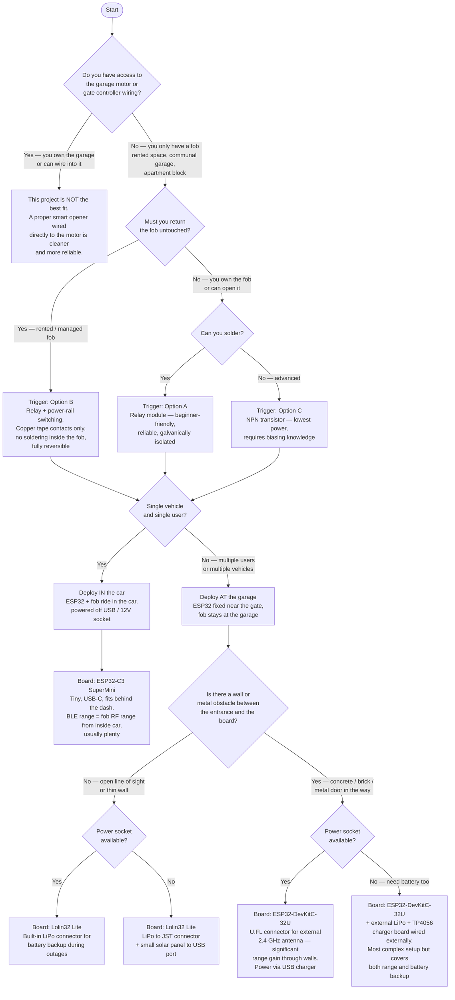

# Advanced

## Decision tree — is this project right for you, and how should you deploy it?



> **Picking a geofence radius:** start at the default (40 m) and adjust based on what you observe. BLE range is less of a hard constraint than it might seem — when the geofence fires, the app keeps retrying the BLE connection (up to 8 attempts) as you continue driving closer, so a trigger at 40 m that initially can't reach the ESP32 through a wall will usually succeed by the time you're at the gate. For **in-car deployment** the real limiting factor is the fob's RF range to the gate motor from inside the car — triggering at 75 m is pointless if the fob can't reach the gate from there. For **at-garage deployment** a tighter radius (20–35 m) is still better to avoid wasting retry budget on a distance where BLE has no chance. If the gate opens a few seconds after you've already stopped, widen the radius so it triggers earlier; if it fires while you're still too far away and the fob can't reach the motor, shrink it.

> **This chart is orientative.** The board recommendations are based on common trade-offs — if you already have a different ESP32 board lying around, or you want to spend less, it will almost certainly work. Any ESP32 variant with BLE is supported; see [Adding a board not in the list](#adding-a-board-not-in-the-list) below. Real-world BLE range also varies a lot by environment, so treat the deployment guidance as a starting point and adjust based on what you observe in your specific garage.

---

## Supported boards

The following boards have pre-configured environments in `firmware/platformio.ini`:

| Env name        | Board                  | Default trigger pin |
|-----------------|------------------------|---------------------|
| `esp32c3`       | ESP32-C3-DevKitM-1     | GPIO 8              |
| `lolin32lite`   | Wemos Lolin32 Lite     | GPIO 26             |
| `esp32dev`      | ESP32-DevKitC          | GPIO 26             |
| `lolin32`       | Wemos Lolin32          | GPIO 26             |
| `esp32s3`       | ESP32-S3-DevKitC-1     | GPIO 4              |
| `nodemcu32s`    | NodeMCU ESP32-S        | GPIO 26             |

The ESP32-C3 SuperMini uses the same chip as the DevKitM-1 — the `esp32c3` env covers both.

The ESP32-DevKitC-32U (external antenna variant) uses the same chip and pinout as the standard DevKitC — the `esp32dev` env covers both. Select option 3 in the flash tool.

Each env also has a `_debug` variant (e.g. `esp32c3_debug`) that enables verbose serial logging.

The pre-built `.bin` attached to each release is ESP32-C3 only. For any other board you must build from source.

---

## Flashing with the flash tool (recommended)

`firmware/flash.bat` (Windows) handles everything interactively — board selection, port detection, PIN entry, and flashing. Just double-click it or run from a terminal:

```
flash.bat
```

It will walk you through each step. No manual config editing needed.

### Selecting a board

The tool shows a numbered list of supported boards and prompts you to pick one. You can also pass `-Board` to skip the prompt:

```
flash.bat -Board lolin32lite
```

Valid values match the env names in the table above (`esp32c3`, `lolin32lite`, `esp32dev`, etc.).

### Selecting a COM port

The tool auto-detects ESP32 boards by USB VID/PID. If multiple are found it asks you to pick. You can also pass `-Port` to skip detection:

```
flash.bat -Board esp32dev -Port COM5
```

### Advanced options

After the PIN step the tool offers optional overrides — press Enter at each to keep the default:

| Option | Default | Notes |
|---|---|---|
| Trigger GPIO | Board default (see table above) | Override if your wiring uses a different pin |
| Sleep duration | 5 s | Lower = more responsive, higher = more battery life |
| Pulse duration | 1500 ms | How long the fob button is held. Increase for slow fobs |
| BLE device name | `Garage-Opener` | Change if you have multiple units |
| Web log server | Disabled | Enables Wi-Fi AP + captive portal event log page |

---

## Flashing manually (advanced)

If you prefer to build and flash without the interactive tool:

```
python -m platformio run -e <env_name> --target upload
```

PIN and other settings are injected via build flags — they are never stored in any file:

```
python -m platformio run -e lolin32lite --target upload ^
  --project-option "build_flags=-DCORE_DEBUG_LEVEL=0 -DUSER_PIN=\"yourpin\" -DDEVICE_NAME=\"Garage-Opener\""
```

---

## Adding a board not in the list

1. Look up the board ID: `python -m platformio boards espressif32`
2. Add an env block to `firmware/platformio.ini`:
   ```ini
   [env:myboard]
   board = <board_id>
   build_flags =
       -DCORE_DEBUG_LEVEL=0
       -DTRIGGER_PIN=<gpio>
   ```
3. Flash with `python -m platformio run -e myboard --target upload`

Pick a GPIO that has no strapping function and is not shared with USB serial on your specific board.

---

## Replicating for others

Each person builds their own unit with their own PIN. The repository contains no secrets.
Share the PIN privately; share the code publicly.
