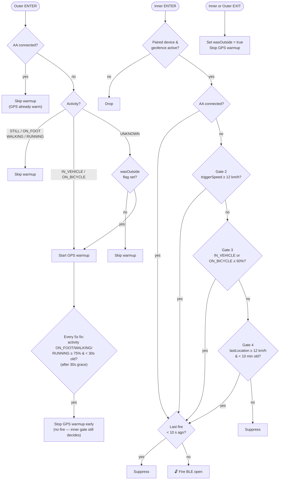

# Geofence Auto-open

When enabled, the garage opens automatically as you approach — no tap needed. This document describes how the trigger logic works, what gates must pass, and how the GPS warmup system improves reliability without AA.

---

## Setup

In the phone app: **Settings → (device) → Auto-open → Garage location** — tap the map to set that device's pin and drag the radius slider (15–75 m). Enable the **Auto-open on arrival** toggle. That's it.

With 2+ devices paired, each device has its own independent geofence — set up, evaluated, and debounced separately. A device with no geofence configured simply never auto-fires from location; it stays reachable via the picker and its own BLE-presence auto-fire (see [Resolution across multiple devices](#resolution-across-multiple-devices) below).

---

## How it triggers

Two geofences are registered per device around its configured location:

- **Inner geofence** — at your configured radius (15–75 m). This is the trigger zone.
- **Outer geofence** — at your configured radius + warmup ring offset (default 250 m, adjustable 15–1000 m). This is the GPS warmup zone.

When you cross the **inner geofence** boundary inbound (ENTER transition), the app runs a gate chain to decide whether to fire. When you cross the **outer geofence** inbound, the app warms up GPS so speed data is available by the time the inner geofence fires.

---

## Gate chain (inner geofence ENTER)

Gates are evaluated in order. The first one that passes fires the open; if all fail, the trigger is suppressed.

| Gate | Condition | Notes |
|------|-----------|-------|
| **1 — AA connected** | Android Auto is actively connected | Strongest signal — binary OS fact, no GPS needed |
| **2 — Trigger speed** | Speed from the geofence event ≥ 12 km/h | Only available if GPS was already warm at the moment of crossing |
| **3 — Activity** | `IN_VEHICLE` or `ON_BICYCLE` with ≥ 50% confidence | `ON_BICYCLE` is included because Android classifies motorbikes as `ON_BICYCLE` at low speed |
| **4 — Last known speed** | Most recent location fix speed ≥ 12 km/h, within 10 min | Useful if navigation was recently active |

If all four gates fail the trigger is logged as suppressed with the full reason.

### Why AA is the best gate

AA being connected is a binary OS-level fact — it's the authoritative signal that you're in a vehicle and driving. It also keeps the phone's location stack warm (Maps/navigation runs continuously), which means geofence ENTER fires within ~1–2 s of the actual boundary crossing instead of the 30 s–2 min worst-case under Doze.

### Why speed gating is unreliable without AA

Geofences can fire off cell/WiFi positioning, which produces lat/lng but no speed. Speed requires GPS, which must be actively running to have a fresh sample. If no app is keeping GPS warm, the geofence event arrives with `speed = 0` and `lastLocation` also has no speed. This is the problem the outer geofence warmup solves.

### Motorbike support

Android classifies motorbikes as `ON_BICYCLE` at low speed rather than `IN_VEHICLE`. Gate 3 accepts both, so a motorbike approaching at any speed will pass on activity confidence alone. Gate 2 (trigger speed ≥ 12 km/h) remains a parallel path for higher-speed approaches.

---

## Outer geofence — GPS warmup

The outer geofence fires at the configured warmup ring offset before the inner one (default 250 m, adjustable 15–1000 m via the slider in the geofence picker). On ENTER, a short-lived foreground service (`GpsWarmupForegroundService`) starts requesting location updates at **5 s intervals**.

GPS needs at least two consecutive fixes (~10 s) to compute speed. At 30–50 km/h you cross the default 250 m offset in 18–30 s, giving the GPS stack enough time to produce a valid speed reading before the inner geofence fires.

### Warmup is skipped when

- Android Auto is connected — GPS is already warm via the AA location stack
- Activity is `STILL`, `WALKING`, or `RUNNING` — clearly not in a vehicle
- Activity is `UNKNOWN` and no prior outer geofence EXIT was recorded — likely still at home (see exit flag below)

`IN_VEHICLE` or `ON_BICYCLE` always starts the warmup regardless of the exit flag — confident vehicle signals override everything.

### Exit flag

When the **inner** geofence EXIT fires, a `wasOutsideOuterGeofence` boolean is saved to SharedPreferences. The inner geofence is used (not the outer) because it's centered on the actual garage — an inner EXIT confirms you've genuinely left the garage area, whereas an outer EXIT could happen anywhere in the wider warmup zone. On the next outer ENTER:

- If the flag is `true` → you genuinely left and came back → warmup starts for `UNKNOWN` activity too
- If the flag is `false` → no confirmed departure recorded → `UNKNOWN` activity is treated conservatively and warmup is skipped

This prevents spurious GPS warmup sessions when you're stationary at home and the OS fires an ENTER due to a re-register or GPS jitter, where activity comes back `UNKNOWN`.

**If EXIT is dropped by the OS** (which Android does occasionally under Doze), the flag stays `false`. The consequence is that one approach with `UNKNOWN` activity may miss the warmup — but `IN_VEHICLE`/`ON_BICYCLE` still work, and the next EXIT+ENTER cycle resets correctly. The flag is an optimistic hint, not a hard gate.

### Warmup stop conditions

The service stops on whichever comes first:

1. **Outer geofence EXIT** — you left the outer zone without entering the inner
2. **Inner gate pass** — the open fired; warmup is no longer needed
3. **Early activity stop** — after a 30 s grace period, if a GPS fix arrives while cached activity reads `ON_FOOT`, `WALKING`, or `RUNNING` at ≥ 75% confidence and that reading is < 30 s old, the warmup stops itself. This is a battery/GPS-usage optimization, not a trigger — it never fires the open; the inner geofence gate chain is still the only thing that can do that. `STILL` is deliberately excluded from this check: an idling car at a red light is indistinguishable from a parked one to the motion sensors, so it isn't a safe "definitely not driving" signal — only gait-based activities (which a car cannot produce) are trusted to stop warmup early. Speed alone is also deliberately not used, since the outer radius can span multiple stop signs or red lights where speed legitimately drops to 0 mid-approach.
4. **5-minute timeout** — safety net for dropped EXIT events (the OS occasionally fails to deliver EXIT under Doze). If the app crashes, the location client dies with it — no leak.

---

## Debounce

After a successful open, a 10-second debounce prevents re-triggering. The debounce is tracked **per device**, not globally — two geofences entered close together (an outer gate and a garage door on the same property, for example) can't have one device's auto-open silently suppress the other's. Both the geofence service and the AA car screen share the same per-device `lastAutoFiredAt` timestamp in encrypted storage — cross-process races are absorbed.

Only confirmed successful opens (`OpenResult.Success`) write the timestamp. Failed attempts do not block subsequent triggers.

---

## Resolution across multiple devices

Geofence auto-open (this document) is the fully-automatic, no-tap path — a passed gate chain fires the BLE open with no user interaction. Separately, every manual-tap surface (the phone's "Selected opener" dropdown, Android Auto, the watch, and the Quick Settings tile) also reads current geofence presence to decide what a *tap* should do:

- If you're standing inside a device's geofence right now, that device (or devices, if two geofences overlap) is pre-selected or shown as a single one-tap button, instead of making you pick from a list.
- Devices with no geofence configured are never part of this pre-selection — RF/BLE range alone isn't a reliable "you are here" signal the way a geofence is, so those devices are only ever reached by manually picking them or through their own BLE-presence auto-fire.
- This resolution is purely a selection convenience for taps — it never fires anything on its own. Only the gate chain above can trigger a no-tap open.

---

## Re-registration

Geofences are re-registered:

- On device boot (`BOOT_COMPLETED`)
- On app update (`MY_PACKAGE_REPLACED`)
- On every app cold start
- Every ~15 minutes via WorkManager (covers OEM process killers)

Both inner and outer geofences are registered together. After an app update, the outer geofence is added automatically on the next re-register cycle — no user action needed.

`setInitialTrigger(0)` is set on all geofencing requests so re-registration does not fire spurious ENTER events if you're already inside the zone.

---

## Notifications

- **Approaching garage…** — shown while the GPS warmup service is active (typically 10–30 s). Disappears automatically when the service stops.
- **Garage opened** — posted on successful auto-open. Auto-dismisses after 5 s.
- **Couldn't open garage** — posted if all BLE retry attempts fail. Tap the app to open manually.

---

## Logs

Every gate evaluation is written to the geofence log. Share it via **Settings → Diagnostics → Share geofence log** to inspect exactly what happened on each approach — speeds, activity types, gate results, and suppression reasons are all logged.
